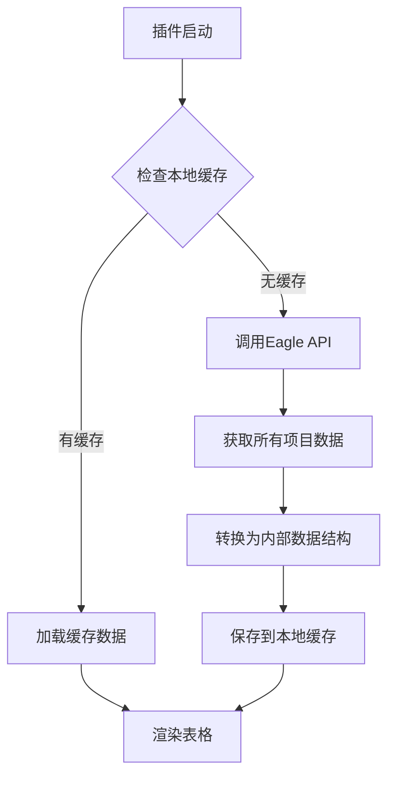
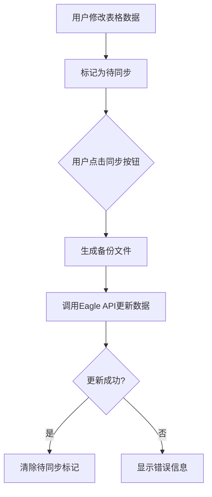

# Eagle Ontology Manager 技术文档

## 1. 项目概述

Eagle Ontology Manager 是一个基于 Eagle Plugin API 开发的插件，旨在为 Eagle 提供一个可视化的图像属性本体管理系统。该系统允许用户以层级化、表格化的方式管理图片的语义属性，并支持导出、同步等功能。

## 2. 技术架构设计

### 2.1 整体架构

```
┌─────────────────────────────────────────────────────────┐
│                  Eagle Application                      │
├─────────────────────────────────────────────────────────┤
│              Eagle Ontology Manager Plugin              │
│  ┌───────────────┐  ┌──────────────┐  ┌──────────────┐  │
│  │  Frontend UI  │  │ Data Process │  │ Eagle Bridge │  │
│  │ (HTML/CSS/JS) │  │    Layer     │  │     API      │  │
│  └───────────────┘  └──────────────┘  └──────────────┘  │
└─────────────────────────────────────────────────────────┘
          │                       │               │
          ▼                       ▼               ▼
   Tabulator.js            Data Processing    Eagle Plugin 
   表格组件                & Transformation   JavaScript API
                                               (getAllItems,
                                                updateItemMetadata等)
```

### 2.2 技术栈

| 模块 | 技术 | 说明 |
|------|------|------|
| 插件框架 | Eagle Plugin System | 基于 JS/HTML，本地运行 |
| 前端框架 | Vanilla JavaScript + Tabulator.js | 构建动态表格界面 |
| 数据处理 | JavaScript (ES6+) | 数据转换和处理逻辑 |
| 数据导出 | PapaParse | CSV 格式转换 |
| 数据存储 | localStorage/Eagle API | 本地缓存和数据同步 |

## 3. 核心模块设计

### 3.1 文件读取模块

**功能**: 通过 Eagle API 获取当前素材库所有图片及其元数据

**技术实现**:
- 使用 `eagle.getAllItems()` API 获取图片数据
- 提取关键字段: id, name, folders, tags, annotation, url, lastModified
- 数据缓存机制提升二次加载速度

**数据结构**:
```javascript
{
  id: String,              // Eagle项目ID
  name: String,            // 文件名
  folders: Array[String],  // 所属文件夹列表
  tags: Array[String],     // 标签列表
  annotation: String,      // 注释
  url: String,             // 文件URL
  lastModified: Timestamp  // 最后修改时间
}
```

### 3.2 属性映射模块

**功能**: 将文件夹层级、标签结构、注释内容映射为"属性层级"

**技术实现**:
- 解析文件夹路径结构，转换为层级属性
- 将标签映射为扁平属性
- 支持用户自定义属性模板

**示例**:
```
文件夹路径: /自然/动物/猫
映射结果: {
  "内容": {
    "一级": "自然",
    "二级": "动物", 
    "三级": "猫"
  }
}
```

### 3.3 属性表格模块

**功能**: 前端表格界面（支持图片预览、名称编辑、属性层级编辑、多级表头）

**技术实现**:
- 使用 Tabulator.js 构建可编辑表格
- 支持图片预览列
- 可编辑的文本单元格
- 多级表头支持复杂属性结构
- 支持搜索和过滤功能

### 3.4 同步模块

**功能**: 用户修改图片名称、属性后，一键同步到 Eagle 数据库

**技术实现**:
- 使用 `eagle.updateItemMetadata()` API 更新数据
- 提供同步状态反馈
- 同步前自动备份功能

### 3.5 导出模块

**功能**: 支持导出 CSV、JSON 格式

**技术实现**:
- 使用 PapaParse 库处理 CSV 导出
- 支持嵌套 JSON 结构导出
- 文件下载功能

### 3.6 配置模块

**功能**: 用户定义属性模板、层级结构、显示顺序等

**技术实现**:
- 模板管理系统
- 用户偏好设置存储
- 属性列动态配置

## 4. 数据流设计

### 4.1 数据加载流程



### 4.2 数据同步流程



## 5. UI/UX 设计

### 5.1 主界面布局

```
┌──────────────────────────────────────────────────────────┐
│ 工具栏 [选择属性模板] [导出CSV] [同步到Eagle] [刷新]     │
├──────────────────────────────────────────────────────────┤
│ 搜索栏                                                   │
├──────────────────────────────────────────────────────────┤
│ 表格区域                                                 │
│ ┌──────────────────────────────────────────────────────┐ │
│ | 预览 | 名称 | 内容:一级 | 内容:二级 | 语境:时间 | 来源 | │
│ |------|------|-----------|-----------|-----------|------| │
│ | 🖼️  | cat..| 自然      | 动物       | 19世纪     | 网络 | │
│ | 🖼️  | brid.| 社会      | 建筑       | 20世纪     | 摄影 | │
│ └──────────────────────────────────────────────────────┘ │
└──────────────────────────────────────────────────────────┘
```

### 5.2 交互设计

1. **表格操作**:
   - 单元格双击编辑
   - 批量选择和编辑
   - 右键菜单操作

2. **状态反馈**:
   - 加载状态指示器
   - 操作成功/失败提示
   - 进度条显示同步进度

## 6. 安全性和错误处理

### 6.1 错误处理策略

1. **API调用失败**:
   - 显示友好的错误消息
   - 提供重试选项
   - 记录错误日志

2. **数据验证**:
   - 输入数据格式校验
   - 必填字段检查
   - 数据范围验证

### 6.2 数据安全

1. **备份机制**:
   - 同步前自动备份
   - 提供备份恢复功能

2. **权限控制**:
   - 遵循Eagle API权限限制
   - 用户确认敏感操作

## 7. 性能优化

### 7.1 数据加载优化

- 分页加载大量数据
- 本地缓存减少重复请求
- 虚拟滚动提高表格渲染性能

### 7.2 内存管理

- 及时释放不需要的对象引用
- 图片懒加载减少内存占用
- 定期清理过期缓存

## 8. 开发计划

### 阶段一：基础框架搭建
- [ ] 插件基础结构创建
- [ ] Eagle API集成
- [ ] 数据加载和展示

### 阶段二：核心功能实现
- [ ] 表格编辑功能
- [ ] 数据同步机制
- [ ] 基础导出功能

### 阶段三：高级功能开发
- [ ] 属性模板系统
- [ ] 高级搜索和过滤
- [ ] 数据可视化模块

### 阶段四：完善和优化
- [ ] 性能优化
- [ ] 用户体验改进
- [ ] 错误处理完善